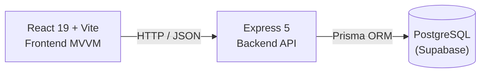

<div align="center">

# SafeAnchor

> Digitalizando gestão de frota, segurança operacional e capacitação profissional para o setor maritimo.

**MVP de apresentacao — investidores, Parque Tecnologico do Mar banca e parceiros**


</div>

---

## Visao geral

SafeAnchor e uma plataforma **Vertical SaaS** pensada para o ecossistema maritimo — proprietarios, gestores de frota, prestadores de servicos e marinas.

O projeto nasce no **Parque Tecnologico do Mar (PTM)**, em Caucaia (CE), e nasce como
**MVP de apresentacao**: funcional o suficiente para demonstrar a proposta de valor
e validar a visao com investidores, parceiros e a banca de incubacao.

---

## Visao de negocio

> Se a premissa for correta, **o setor nao precisa so de um app, mas de uma camada operacional que conecte todo o ecossistema maritimo**.

### O que o setor ainda usa hoje

- Planilhas e cadernos
- Checklists em papel e inspecoes manuais
- Registro informal de manutencao
- Documentacao descentralizada
- Treinamentos profissionais fragmentados

Esses processos **aumentam riscos operacionais**, **reduzem eficiencia** e **dificultam a conformidade**.

### O que o SafeAnchor entrega

Uma **camada operacional unificada** que centraliza:

- **Gestao de frotas** — prontidao das embarcações em tempo real
- **Manutencao** — agenda, historico, previsao
- **Documentacao** — certificados e conformidade
- **Checklists e inspecoes** — execucao, historico, certificados
- **Treinamento** — trilhas de capacitacao e certificados de conclusao
- **Marketplace** — conexao entre proprietarios, prestadores e marinas
- **Vida a bordo** — registros de viagens e seguranca

---

## Modelo de negocio

| Persona | Papel | Valor pago |
|---|---|---|
| **Proprietario / gestor de frota** | Gerencia embarcações, manutencao e documentos | Assinatura mensal (SaaS) |
| **Prestador de servicos** | Recebe chamados, agenda inspecoes, gera certificados | Comissao por servico + planos premium |
| **Marina** | Gerencia ocupacao, equipe, servicos e reservas | Planos de operacao + comissao por intermedio |

### Mecanismos de receita

- **Subscriptions (SaaS)** — planos mensais por persona
- **Transacoes (Marketplace)** — comissao sobre concretizacao de servicos
- **Dados agregados (Analytics)** — relatorios e insights para o setor

### Fases de evolucao

1. **Fase 1 (MVP)** — Proprietarios (frota + manutencao + inspecao)
2. **Fase 2** — Inclusao de prestadores e marketplace
3. **Fase 3** — Marina como operadora central
4. **Fase 4** — dados agregados, analytics e insights

---

## User Flow

Diagrama que mostra as principais acoes do usuario por persona — desde o login
ate a concretizacao de um servico ou inspecao.

<p align="center">
  
</p>

Fonte: [`docs/user-flow.mmd`](./docs/user-flow.mmd)

---

## Data Flow

Circulacao dos dados entre o frontend React (MVVM), os ViewModels, os Services
e o backend com Prisma + PostgreSQL.

<p align="center">
  
</p>

Fonte: [`docs/data-flow.mmd`](./docs/data-flow.mmd)

---

## Arquitetura geral



Cada lado possui sua propria organizacao interna:

- [`apps/backend/`](./apps/backend/README.md) — API REST em Express
- [`apps/frontend/`](./apps/frontend/README.md) — Interface em React

No **frontend** (arquitetura MVVM):

```text
PageViews (views/)
    ↓
use*ViewModel hooks (viewmodels/)
    ↓
Services (services/)
    ↓
Mock Data / API
```

No **backend** (Route → Controller → Service → Prisma):

```text
Routes (routes/)
    ↓
Controllers (controllers/)
    ↓
Services (services/)
    ↓
Prisma ORM (lib/prisma.js)
    ↓
PostgreSQL (Supabase)
```

---

## Stack

| Camada | Tecnologia |
|---|---|
| Frontend | React 19, Vite 7, react-router-dom v7 |
| CSS | BEM methodology, co-localizado por componente |
| Backend | Node.js, Express 5, pino (logging) |
| Persistencia | PostgreSQL (Supabase) via Prisma 7 |
| Auth | JWT (bcrypt + jsonwebtoken) |
| Deploy frontend | GitHub Pages (Vite build + SPA fallback) |
| CI/CD | GitHub Actions (lint, test, build) |

---

## Estrutura

```text
safeanchor-monorepo/
├── apps/
│   ├── backend/
│   │   ├── prisma/
│   │   │   └── schema.prisma              # schema do banco
│   │   ├── src/
│   │   │   ├── controllers/               # validacao HTTP
│   │   │   ├── lib/                       # prisma client, logger
│   │   │   ├── middleware/                 # auth, roles
│   │   │   ├── models/                    # queries prisma
│   │   │   ├── routes/                    # rotas REST
│   │   │   ├── services/                  # regras de negocio
│   │   │   ├── app.js                     # criacao do Express
│   │   │   └── server.js                  # bootstrap
│   │   ├── package.json
│   │   └── README.md
│   │
│   └── frontend/
│       ├── public/
│       ├── src/
│       │   ├── components/                # componentes compartilhados
│       │   ├── context/                   # React context (auth)
│       │   ├── mock/                      # dados simulados
│       │   ├── router/                    # AppRouter + AppShell
│       │   ├── services/                  // camada de dados
│       │   ├── styles/                    # BEM CSS global
│       │   ├── viewmodels/                # hooks de logica (MVVM)
│       │   ├── views/                     # paginas (PageViews)
│       │   ├── App.jsx
│       │   └── main.jsx
│       ├── vite.config.js
│       ├── package.json
│       └── README.md
│
├── docs/
│   ├── architecture/
│   ├── product/
│   ├── data-flow.mmd
│   ├── user-flow.mmd
│   └── README.md
│
└── README.md
```

---

## Como executar

### Pre-requisitos

- Node.js >= 20
- npm
- Git
- Conta no Supabase (variaveis `DATABASE_URL` e `DIRECT_URL`)

### Clonar o repositorio

```bash
git clone https://github.com/luis-botelho/safeanchor-monorepo.git
cd safeanchor-monorepo
```

### Backend — terminal 1

```bash
cd apps/backend
npm install
cp .env.example .env     # preencha as variaveis do Supabase
npx prisma generate
npm run dev
```

API disponivel em:

```text
http://localhost:3000
```

### Frontend — terminal 2

```bash
cd apps/frontend
npm install
npm run dev
```

Aplicacao disponivel em:

```text
http://localhost:5173
```

> O backend precisa estar rodando para que o frontend consiga autenticar
> e acessar os dados da API.

---

## API — resumo dos endpoints

### Publicos

| Metodo | Rota | Descricao |
|---|---|---|
| `GET` | `/` | Status da API |
| `GET` | `/health` | Health check |
| `POST` | `/auth/register` | Cadastro de usuario |
| `POST` | `/auth/login` | Login (retorna JWT) |

### Autenticados

| Metodo | Rota | Descricao |
|---|---|---|
| `GET` | `/modules` | Modulos disponiveis |
| `GET` | `/vessels` | Lista de embarcacoes |
| `POST` | `/vessels` | Cria embarcacao |
| `PUT` | `/vessels/:id` | Atualiza embarcacao |
| `DELETE` | `/vessels/:id` | Remove embarcacao |
| `GET` | `/maintenances` | Lista de manutencoes |
| `POST` | `/maintenances` | Cria manutencao |
| `GET` | `/preventive-maintenances` | Agenda preventiva |
| `POST` | `/preventive-maintenances` | Cria item preventivo |
| `GET` | `/checklist-templates` | Templates de checklist |
| `POST` | `/checklist-templates` | Cria template |
| `GET` | `/checklist-executions` | Execucoes de checklist |
| `POST` | `/checklist-executions` | Registra execucao |

> Documentacao completa disponivel nos sub-READMEs.

---

## Modulos implementados (MVP de apresentacao)

| Modulo | Descricao | Status |
|---|---|---|
| Autenticacao | Cadastro, login, JWT, roles | Funcional |
| Gestao de frotas | CRUD de embarcacoes + prontidao | Funcional |
| Manutencao | Agenda, historico, dashboard | Funcional |
| Manutencao preventiva | Previsao e agendamento | Funcional |
| Checklists (templates) | Templates reutilizaveis | Funcional |
| Checklists (execucoes) | Registro e historico | Funcional |
| Inspecoes | Agendamento e certificados | Funcional |
| Dashboard | Visao consolidada por persona | Funcional |
| Perfil do usuario | Dados e configuracoes | Funcional |

### Mapeados mas com dados mock (proximas iteracoes)

- Marketplace
- Comunidade
- Eventos
- Treinamento (Academy)
- Planos de marinas
- Reservas
- Equipe de marinas
- Servicos de marinas
- Viagens
- Aluguel de embarcacoes
- Documentos
- IA

---

## Decisoes tecnicas

### Arquitetura MVVM no frontend

O frontend separa a interface (PageViews) da logica de negocio (ViewModels)
e da camada de dados (Services). Isso mantem as views limpas e testaveis.

### Backend em camadas (Route → Controller → Service → Prisma)

Cada camada tem uma responsabilidade:
- **Routes** — declaracao de endpoints
- **Controllers** — validacao HTTP e formato de resposta
- **Services** — regras de negocio
- **Models/Prisma** — queries ao banco

Isso permite trocar o banco (Prisma → outra ORM) sem alterar as regras de negocio.

### Mock data no frontend (MVP)

O MVP de apresentacao usa arquivos `.js` com dados simulados no frontend,
permitindo demonstrar as telas sem depender do backend em todas as situacoes.
A camada de Services esta pronta para conectar ao backend via HTTP quando necessario.

### Prisma + Supabase (PostgreSQL)

Prisma foi escolhido como ORM para type-safety e migracoes declarativas.
Supabase oferece PostgreSQL gerenciado com autenticacao e storage opcional.

### GitHub Pages (SPA fallback)

O frontend e deployado via GitHub Pages com `404.html` como fallback
para suporte a rotas do `react-router-dom`.

---

## Limitacoes conhecidas

- Dados de demonstracao sao simulados no frontend (mock data) — nao persistem entre sessoes
- Apenas autenticacao e modulos basicos de gestao estao conectados ao backend real
- Os modulos de marketplace, comunidade, eventos e marinas estao mapeados mas nao implementados
- Nao existem testes automatizados no frontend
- Deploy do backend (Supabase Edge Functions / Railway) ainda nao configurado

---

## Melhorias futuras

- Conectar todos os services do frontend ao backend via HTTP
- Implementar modulos de marketplace, comunidade e eventos
- Adicionar testes automatizados no frontend
- Deploy do backend em producao
- Notificacoes em tempo real (WebSocket)
- PWA para uso offline em campo

---

<div align="center">

Desenvolvido por **Luis Botelho** · [GitHub](https://github.com/luis-botelho) · [LinkedIn](https://linkedin.com/in/luis-botelho)

</div>
