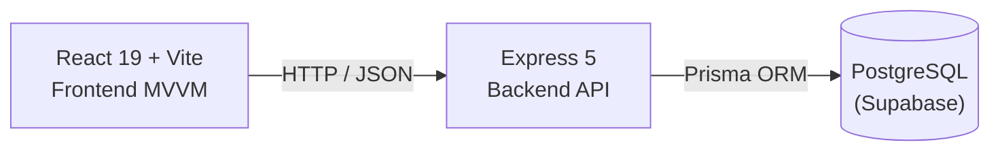

<div align="center">

# SafeAnchor

> Digitalizando gestao de frota, segurança operacional e capacitacao profissional para o setor maritimo.

**MVP de apresentacao — investidores, Parque Tecnologico do Mar banca e parceiros**


</div>

---

Este README e o **Project Control Plane** do SafeAnchor: a fonte principal de
contexto para desenvolvedores e agentes de IA. Ele descreve **o que** o produto
e, **como** esta arquitetado, **o que ja foi implementado** e **o que vem a
seguir**.

> Regra central: nada aqui foi inventado. Todo status foi extraido do estado
> atual do repositorio. Se algo precisa mudar, o repositorio muda primeiro e o
> README depois.

---

## Product Vision

SafeAnchor e uma plataforma **Vertical SaaS** pensada para o ecossistema
maritimo — proprietarios, gestores de frota, prestadores de servicos e marinas.

Se a premissa for correta, **o setor nao precisa so de um app, mas de uma camada
operacional que conecte todo o ecossistema maritimo**.

O projeto nasce no **Parque Tecnologico do Mar (PTM)**, em Caucaia (CE), e nasce
como **MVP de apresentacao**: funcional o suficiente para demonstrar a proposta
de valor e validar a visao com investidores, parceiros e a banca de incubacao.

---

## Problem

### O que o setor ainda usa hoje

- Planilhas e cadernos
- Checklists em papel e inspecoes manuais
- Registro informal de manutencao
- Documentacao descentralizada
- Treinamentos profissionais fragmentados

Esses processos **aumentam riscos operacionais**, **reduzem eficiencia** e
**dificultam a conformidade**.

### O que o SafeAnchor entrega

Uma **camada operacional unificada** que centraliza:

- **Gestao de frotas** — prontidao das embarcacoes em tempo real
- **Manutencao** — agenda, historico, previsao
- **Documentacao** — certificados e conformidade
- **Checklists e inspecoes** — execucao, historico, certificados
- **Treinamento** — trilhas de capacitacao e certificados de conclusao
- **Marketplace** — conexao entre proprietarios, prestadores e marinas
- **Vida a bordo** — registros de viagens e seguranca

---

## Current MVP

O MVP atual segue o **Rebaseline 2026 — Operational Readiness**
([`docs/product/mvp-rebaseline.md`](./docs/product/mvp-rebaseline.md)).

**North Star:**

> O usuario deve entrar no SafeAnchor e entender rapidamente se sua embarcacao
> esta pronta para operar, o que exige atencao e qual e o proximo risco.

**Jornada principal do MVP:**

```
Login → Dashboard → Minha Frota → Embarcacao → Manutencao / Checklists / Documentos → Prontidao Operacional
```

O produto e organizado em torno dessa jornada. Cada feature do rebaseline
contribui para uma etapa dela, do acesso (Login) ate a decisao de prontidao
operacional.

---

## MVP Scope

### In Scope

Features definidas no rebaseline 2026 (Features **031–038**):

| Feature | Nome | Situacao |
|---|---|---|
| **031** | Ownership & Access Scope | ✅ backend implementado |
| **032** | Product Shell & Main Dashboard | ⬜ planejada |
| **033** | Vessel Operational Profile | ⬜ planejada |
| **034** | Documents Core | ⬜ planejada |
| **035** | Expiration & Compliance | ⬜ planejada |
| **036** | Safety Completion & Mobile Polish | ⬜ planejada |
| **037** | MVP UX Polish | ⬜ planejada |
| **038** | CI/CD & Production Deploy | 🔶 parcial (frontend publicado; backend nao) |

A **Definition of Ready** completa esta em
[`docs/product/mvp-rebaseline.md`](./docs/product/mvp-rebaseline.md): a jornada
Login → Prontidao funciona de ponta a ponta, dados isolados por ownership,
dashboard com dados reais, documentos com vencimentos, checklist mobile
funcional, UI consistente e backend + frontend publicados com health check e
smoke test.

### Out of Scope

Nao fazem parte do MVP atual (definido em
[`docs/product/mvp.md`](./docs/product/mvp.md) e `mvp-rebaseline.md`):

- App mobile nativo e execucao de checklist offline-first
- Integracoes AIS e sensores IoT (previsao preditiva com IA)
- Marketplace completo de prestadores (transacao/pagamento)
- Processamento de pagamentos
- Suporte multi-idioma
- Analytics avancados / dados agregados (Fase 4)
- Assinatura nativa de documentos e workflows de certificacao complexos
- Automacoes de notificacao avancadas (alem de alertas do MVP)
- Maritime Academy (Features 021–025) e QR Code avancado — ficam **pos-MVP**
  conforme rebaseline

Além disso, conforme
[AGENTS.md](./AGENTS.md): **nao adicionar** Next.js, TypeScript ou Tailwind
nesta fase; **preservar** Prisma + PostgreSQL.

---

## Personas

### Personas de produto (modelo de negocio)

| Persona | Papel | Valor pago |
|---|---|---|
| **Proprietario / gestor de frota** | Gerencia embarcacoes, manutencao e documentos | Assinatura mensal (SaaS) |
| **Prestador de servicos** | Recebe chamados, agenda inspecoes, gera certificados | Comissao por servico + planos premium |
| **Marina** | Gerencia ocupacao, equipe, servicos e reservas | Planos de operacao + comissao por intermedio |

### Mecanismos de receita

- **Subscriptions (SaaS)** — planos mensais por persona
- **Transacoes (Marketplace)** — comissao sobre concretizacao de servicos
- **Dados agregados (Analytics)** — relatorios e insights para o setor

### Fases de evolucao

1. **Fase 1 (MVP)** — Proprietarios (frota + manutencao + inspecao)
2. **Fase 2** — Inclusao de prestadores e marketplace
3. **Fase 3** — Marina como operadora central
4. **Fase 4** — dados agregados, analytics e insights

### Roles no backend (estado atual)

O schema do banco define roles **`USER`**, **`MANAGER`** e **`ADMIN`**
(`enum UserRole` em `apps/backend/prisma/schema.prisma`). Escritas em vessels,
maintenances, checklists e preventivas exigem `MANAGER` ou `ADMIN`. A
navegacao por persona no frontend e feita com contas demo (mock).

---

## Core User Journey

Jornada do MVP (rebaseline 2026), de acesso ate a decisao de prontidao:

```
Login → Dashboard → Minha Frota → Embarcacao → Manutencao / Checklists / Documentos → Prontidao Operacional
```

Diagrama completo de acoes por persona: [`docs/user-flow.mmd`](./docs/user-flow.mmd)

Circulacao de dados pelo frontend MVVM, services e backend Prisma:
[`docs/data-flow.mmd`](./docs/data-flow.mmd)

---

## Product Areas

Mapa das areas de produto e seu estado atual no repositorio.

| Area | Descricao | Estado |
|---|---|---|
| **Autenticacao** | Cadastro, login, JWT, roles | Backend: ✅ API real. Frontend: 🔶 login por contas demo (mock) |
| **Fleet Management** | CRUD de embarcacoes + prontidao | Backend: ✅ endpoints. Frontend: 🔶 mock |
| **Maintenance** | Agenda, historico, dashboard, preventiva | Backend: ✅ endpoints. Frontend: 🔶 mock (dashboard via API) |
| **Safety Checklists** | Templates + execucoes | ✅ Backend + frontend conectados via API |
| **Inspections** | Agendamento e certificados | 🔶 Frontend mock apenas; backend pendente |
| **Documents & Compliance** | Documentos e vencimentos (Features 034/035) | ⬜ Nao iniciado |
| **Marina operations** | Ocupacao, equipe, servicos, reservas, planos | 🔶 Frontend mock apenas |
| **Marine Academy (treinamento)** | Trilhas e certificados | ⬜ Pos-MVP (Features 021–025) |
| **Marketplace / Community / Events** | Conexao entre personas e networking | 🔶 Frontend mock apenas |
| **Vida a bordo (Trips / Boat Rentals)** | Viagens, aluguel, seguranca | 🔶 Frontend mock apenas |

---

## Architecture


```mermaid
flowchart LR
    A["React 19 + Vite<br/>Frontend MVVM"] -->|"HTTP / JSON"| B["Express 5<br/>Backend API"]
    B -->|"Prisma ORM"| C[("PostgreSQL<br/>(Supabase)")]
```

Cada lado possui sua propria organizacao interna:

- [`apps/backend/`](./apps/backend/README.md) — API REST em Express
- [`apps/frontend/`](./apps/frontend/README.md) — Interface em React

**Frontend (MVVM):**

```text
PageViews (views/)
    ↓
use*ViewModel hooks (viewmodels/)
    ↓
Services (services/)
    ↓
Mock Data / Backend API
```

**Backend (Route → Controller → Service → Prisma):**

```text
Routes (routes/)
    ↓
Controllers (controllers/)
    ↓
Services (services/)
    ↓
Prisma ORM (lib/prisma.js)
    ↓
PostgreSQL (Supabase)
```

### API — resumo dos endpoints

**Publicos:**

| Metodo | Rota | Descricao |
|---|---|---|
| `GET` | `/` | Status da API |
| `GET` | `/health` | Health check (verifica conexao com o banco) |
| `POST` | `/auth/register` | Cadastro de usuario |
| `POST` | `/auth/login` | Login (retorna JWT) |

**Autenticados:**

| Metodo | Rota | Descricao |
|---|---|---|
| `GET` | `/auth/me` | Dados do usuario autenticado |
| `GET` | `/modules` | Modulos disponiveis |
| `GET` `/POST` | `/vessels` | Lista / cria embarcacoes |
| `GET` | `/vessels/:id` | Detalhe de embarcacao |
| `PUT` / `DELETE` | `/vessels/:id` | Atualiza / remove embarcacao |
| `GET` | `/vessels/:id/maintenances` | Manutencoes da embarcacao |
| `GET` | `/vessels/:id/inspections` | Checklists executados na embarcacao |
| `GET` `/POST` | `/maintenances` | Lista / cria manutencoes |
| `GET` | `/maintenances/dashboard` | Dashboard de manutencao |
| `GET` `/POST` | `/preventive-maintenances` | Agenda preventiva |
| `GET` `/POST` | `/checklist-templates` | Templates de checklist |
| `GET` `/POST` | `/checklist-executions` | Execucoes de checklist |

Escritas em recursos de dominio exigem `MANAGER` ou `ADMIN`.

> Documentacao completa nos sub-READMEs: [`apps/backend/README.md`](./apps/backend/README.md) e [`apps/frontend/README.md`](./apps/frontend/README.md).

---

## Tech Stack

| Camada | Tecnologia |
|---|---|
| Frontend | React 19, Vite 7, react-router-dom v7 |
| CSS | BEM methodology, co-localizado por componente |
| Backend | Node.js 20+, Express 5, pino (logging) |
| Persistencia | PostgreSQL (Supabase) via Prisma 7 |
| Auth | JWT (bcrypt + jsonwebtoken) |
| Deploy frontend | GitHub Pages (Vite build + SPA fallback) |
| CI/CD | GitHub Actions (backend: generate + validate + test; frontend: build) |

Sem TypeScript, sem Tailwind, sem Next.js — por decisao explícita
([AGENTS.md](./AGENTS.md)).

---

## Repository Structure

```text
safeanchor-monorepo/
├── apps/
│   ├── backend/
│   │   ├── prisma/
│   │   │   ├── schema.prisma              # schema do banco
│   │   │   ├── migrations/                # 0_init + evoluções de identidade/ownership
│   │   │   └── seed.js                    # seed de desenvolvimento (protegido por flag)
│   │   ├── src/
│   │   │   ├── controllers/               # validacao HTTP
│   │   │   ├── lib/                       # prisma client, logger
│   │   │   ├── middleware/                # auth (JWT), roles
│   │   │   ├── models/                    # queries prisma
│   │   │   ├── routes/                    # rotas REST
│   │   │   ├── services/                  # regras de negocio (incl. accessScope)
│   │   │   ├── app.js                     # criacao do Express
│   │   │   └── server.js                  # bootstrap
│   │   ├── test/                          # testes (node --test)
│   │   ├── .env.example
│   │   ├── package.json
│   │   └── README.md
│   │
│   └── frontend/
│       ├── public/
│       ├── src/
│       │   ├── components/                # componentes compartilhados
│       │   ├── context/                   # AuthContext (login por contas demo)
│       │   ├── mock/                      # dados simulados por modulo
│       │   ├── router/                    # AppRouter + AppShell
│       │   ├── services/                  # camada de dados (mock e/ou API)
│       │   ├── styles/                    # BEM CSS global
│       │   ├── viewmodels/                # hooks de logica (MVVM)
│       │   ├── views/                     # paginas (PageViews)
│       │   ├── App.jsx
│       │   └── main.jsx
│       ├── vite.config.js                 # base via VITE_BASE_URL
│       ├── package.json
│       └── README.md
│
├── packages/
│   └── shared/                            # reservado para o futuro (nao usado agora)
│
├── docs/                                  # roadmap, changelog, arquitetura, produto,
│                                          # learning, sprints, retrospectives, releases, deploy
│
├── .github/workflows/
│   ├── ci.yml                             # backend (generate+validate+test), frontend (build)
│   └── deploy-frontend.yml                # GitHub Pages (SPA fallback)
│
├── AGENTS.md                              # regras para agentes de IA
└── README.md
```

---

## Current Implementation Status

> Estado verificado no snapshot atual do repositorio (branch `main`).
> Nao confie em "funcional" sem olhar a tabela — no frontend, muitos modulos
> exibem dados mock.

### Completed

**Backend (API real, PostgreSQL via Prisma):**

- [x] Autenticacao (register/login/me) com **bcrypt (custo 12)** + **JWT** (1h)
- [x] Autorizacao por roles **USER / MANAGER / ADMIN** (`authorizeRoles`)
- [x] **Ownership & Access Scope** (Feature 031) — `accessScopeService` filtra por party do usuario + organizacoes
- [x] CRUD de embarcacoes (listar, criar, detalhe, atualizar, remover)
- [x] Manutencoes + dashboard
- [x] Manutencao preventiva
- [x] Templates e execucoes de checklist
- [x] Endpoint `/modules`
- [x] Health check com conexao ao banco
- [x] Logging estruturado com pino + redacao de campos sensiveis
- [x] Prisma + PostgreSQL + migrations versionadas (baseline `0_init` registrada)
- [x] Seed de desenvolvimento protegido por `ALLOW_DATABASE_SEED`
- [x] Testes com `node --test` (authMiddleware, authorization, ownership-scope, observability, server) + smoke test protegido por flag

**Frontend (React 19 + Vite, MVVM):**

- [x] Arquitetura MVVM (views → viewmodels → services)
- [x] AppShell com navegacao por persona
- [x] Autenticacao via contas demo (mock)
- [x] Deploy no GitHub Pages via Actions + fallback SPA `404.html`
- [x] Conectados ao backend via API: `modules`, `preventive-maintenances`, `checklist-templates`, `checklist-executions`, `maintenances/dashboard`
- [x] Modulos em **mock**: vessels, maintenance, inspections, marinas (operações/equipe/servicos/reservas/planos/catalogo), marketplace, comunidade, eventos, academy, jobs & crew, trips/boat rental, documentos, IA

**Fundacao (documentacao):**

- [x] Product vision, MVP, business rules, domain model, arquitetura, rebaseline, changelog, learning/retrospectives

### In Progress

Nenhum trabalho aberto na branch `main` (working tree limpo). Os proximos itens
do rebaseline estao definidos e nao iniciados:

- [ ] **032** — Product Shell & Main Dashboard
- [ ] **033** — Vessel Operational Profile
- [ ] **034** — Documents Core
- [ ] **035** — Expiration & Compliance
- [ ] **036** — Safety Completion & Mobile Polish
- [ ] **037** — MVP UX Polish
- [ ] **038** — Production Deploy (backend)

### Next

1. Feature **032** — Product Shell & Main Dashboard
2. Feature **033** — Vessel Operational Profile
3. Feature **034** — Documents Core (modelo `Document` no Prisma + Supabase Storage)

### Blocked

- **Backend em producao** — nenhuma plataforma definida (deploy.md diz "ainda nao").
- **Documents / Expiration** — dependem de modelo `Document` no Prisma + Supabase Storage.
- **Seguranca no upload / mobile offline** — dependem das Features 034/036.

### Known Limitations (verificadas)

- Dados de demonstracao do frontend sao simulado (mock) — nao persistem entre sessoes
- O **login do frontend usa contas demo** (`AuthContext`); o backend tem API real, mas a UI ainda nao consome `/auth/login`
- Embarcacoes e manutencoes sao **mock no frontend**; apenas preventivas, checklists, dashboard e modules consomem a API real
- Inspections existem somente como mock no frontend (backend pendente)
- Nao ha testes automatizados no frontend
- Nao ha lint configurado (sem ESLint no repositorio)
- Deploy do backend em producao ainda nao configurado

---

## Roadmap

Mapa em blocos sequenciais. O objetivo aqui e mostrar o mapa, nao detalha-lo.

1. **Product / UX** — Rebaseline 2026 validado; jornada Login → Prontidao definida. Proximo: Features 032/033/037.
2. **Frontend** — MVVM pronto; maioria dos modulos em mock. Proximo: conectar frota/manutencao/inspecoes a API; testes automatizados.
3. **Backend / API** — Nucleo REST pronto (auth, vessels, maintenances, checklists, modules). Pendente: inspecoes, documentos, notificacoes, OpenAPI/Swagger, refresh token.
4. **Database** — Prisma + PostgreSQL + migrations e RLS sem policies prontos. Pendente: modelo `Document`, políticas de propriedade quando necessario.
5. **Authentication** — JWT + bcrypt prontos no backend. Pendente no MVP: refresh token; tela de login consumindo a API real.
6. **Authorization** — Roles + ownership prontos. Pendente: permissoes por modulo e por organizacao.
7. **Core Maritime Domain** — Frota, manutencao, preventiva e checklists prontos. Pendente: inspecoes (backend) e documentos.
8. **Storage** — Nao iniciado; necessario para Documents (Supabase Storage).
9. **Mobile** — Nao iniciado; mobile polish de checklists (Feature 036) e PWA sao itens futuros.
10. **Testing** — Backend coberto; faltam testes de controllers no backend e testes no frontend.
11. **Security** — Base presente (hashing, JWT, ownership, RLS, redacao de logs). Pendente: rate limiting, upload security, dependency/security scanning.
12. **Observability** — Logging estruturado + health check prontos. Pendente: metricas, tracing e alertas.
13. **Infrastructure** — Dev local funciona. Pendente: hospedagem de producao do backend.
14. **CI/CD** — CI e deploy do frontend prontos. Pendente: deploy do backend e smoke test em producao (Feature 038).
15. **Production Readiness** — Pendente (Feature 038 + Definition of Ready).
16. **Pilot / Validation** — Pendente; validacao com PTM, parceiros e investidores.

---

## AI Development Workflow

A IA nunca decide sozinha mudancas de escopo. O fluxo e:

```text
Human
  → Analysis
  → Specification
  → AI Implementation
  → Human Review
  → Tests
  → Commit
  → Pull Request
  → Merge
```

A **especificacao** vem do humano (ou de documento aprovado) antes de qualquer
implementacao. Alteracoes de escopo sao propostas pela IA, mas sempre
aprovadas pelo humano.

---

## AI Rules

Regras para agentes de IA que atuarem neste repositorio (tambem em
[AGENTS.md](./AGENTS.md)):

1. Primeiro entender o contexto.
2. Depois analisar.
3. Depois propor plano.
4. So entao implementar.
5. Trabalhar em pequenos incrementos.
6. Nao alterar arquivos fora do escopo.
7. Nao adicionar dependencias sem justificativa.
8. Nao apagar funcionalidades existentes sem autorizacao.
9. Nao considerar uma tarefa concluida sem validacao.
10. Sempre informar arquivos alterados.
11. Sempre informar comandos de validacao executados.
12. Sempre informar limitacoes ou problemas encontrados.

Cuidados de stack nesta fase: nao adicionar Next.js, TypeScript ou Tailwind;
preservar Prisma e PostgreSQL; nunca versionar `.env` ou credenciais do
Supabase; usar `DATABASE_URL` no runtime e `DIRECT_URL` no Prisma CLI.

---

## Definition of Done

Uma tarefa so e considerada concluida quando:

- [x] implementacao realizada;
- [x] testes relevantes executados;
- [x] build validado quando aplicavel;
- [x] comportamento revisado;
- [x] documentacao atualizada quando necessario;
- [x] alteracao revisada pelo humano;
- [x] commit criado.

---

## Development Commands

> Comandos reais extraidos dos `package.json` do repositorio. Nada foi inventado.
> **Nao existe script de lint** (sem ESLint configurado).

### Instalacao

```bash
# raiz — instala frontend e backend
npm run install:all

# ou por app
npm install --prefix apps/backend
npm install --prefix apps/frontend
```

### Backend

```bash
cd apps/backend
cp .env.example .env     # preencha DATABASE_URL / DIRECT_URL / JWT_SECRET

npm run dev              # dev com watch (node --watch src/server.js)
npm start                # producao local (node src/server.js)
```

API por padrao em `http://localhost:3001` (define `PORT` no `.env`).

### Frontend

```bash
cd apps/frontend
npm run dev              # Vite dev server
npm run build            # build de producao (dist/)
npm run preview          # previsualiza o build
```

Aplicacao em `http://localhost:5173`.

> Rodar pela raiz (scripts do monorepo): `npm run dev:frontend`,
> `npm run dev:backend`, `npm run start:backend`.

### Testes

```bash
cd apps/backend
npm test                 # node --test (nao toca no Supabase)

ALLOW_DATABASE_SMOKE=true npm run test:db:smoke   # smoke test contra o banco (consultar docs)
```

### Database / Migrations (backend)

```bash
cd apps/backend
npx prisma generate      # gera o client Prisma
npm run prisma:validate  # valida o schema
npm run prisma:status    # status das migrations

# Seed de desenvolvimento — BLOQUEADO por padrao; habilite somente ciente do destino
ALLOW_DATABASE_SEED=true npx prisma db seed

# Comparar schema com o banco antes de registrar baseline (diff vazio)
npx prisma migrate diff --from-config-datasource --to-schema=prisma/schema.prisma --script
```

> Nunca use `prisma migrate reset` ou `prisma db push` no projeto remoto.

### CI (GitHub Actions)

- `ci.yml` — backend: generate + validate + test; frontend: build
- `deploy-frontend.yml` — build com `VITE_BASE_URL=/safeanchor-monorepo/` e deploy no GitHub Pages

---

## Environment

Somente as variaveis realmente utilizadas pelo projeto. **Nenhum secret ou
valor sensivel aqui** — nunca versione `.env`.

### Backend (`apps/backend/.env`)

| Variable | Obrigatoria | Descricao |
|---|---|---|
| `DATABASE_URL` | sim | Conexao de runtime (Supabase pooler) |
| `DIRECT_URL` | sim* | Conexao para Prisma CLI (migrations/generate/validate) |
| `JWT_SECRET` | sim | Assinatura dos tokens JWT (valor aleatorio longo) |
| `PORT` | nao | Porta do servidor (padrao `3001`) |

`*` `DIRECT_URL` e obrigatoria para comandos do Prisma CLI; em runtime o backend usa apenas `DATABASE_URL`.

Flags de operacao (avaliacao do proprio contexto):

| Flag | Efeito |
|---|---|
| `ALLOW_DATABASE_SEED` | Libera a execucao do seed |
| `ALLOW_DATABASE_SMOKE` | Libera o smoke test contra o banco |

### Frontend

| Variable | Obrigatoria | Descricao |
|---|---|---|
| `VITE_API_URL` | sim (prod) | URL publica da API; em dev usa `/api` |
| `VITE_BASE_URL` | sim (GH Pages) | Base do build; no CI e `./safeanchor-monorepo/` |

> Na raiz nao ha `.env`; o `apps/frontend/.env.example` ainda nao existe no
> repositorio.

---

## Security Baseline

Principios de seguranca do MVP — marcados pelos que **ja existem** no repositorio.

| Tema | Situacao |
|---|---|
| Authentication | ✅ JWT + bcrypt (custo 12), expiracao 1h |
| Authorization | ✅ Roles `USER`/`MANAGER`/`ADMIN` no backend |
| Ownership / Access Scope | ✅ `accessScopeService` isola dados por party/organizacao |
| Password hashing | ✅ bcrypt; hash nunca exposto |
| JWT security | ✅ payload minimo, `JWT_SECRET` via env |
| Input validation | ✅ validacoes nos controllers |
| Rate limiting | ⬜ nao implementado |
| Secure secrets | ✅ `.env*` ignorado; apenas `.env.example` versionado |
| Database security | ✅ RLS ativo sem policies; privilegios de `anon`/`authenticated` revogados; acesso so via backend |
| Upload security | ⬜ depende da Feature 034 (Documents) |
| Logging | ✅ pino estruturado com redacao de headers/body sensiveis |
| Backups | 🔶 via Supabase (gerenciado; fora do codigo) |
| Dependency / security scanning | ⬜ nao configurado |

---

## Product Decision Log

Decisoes ja tomadas. Datas aproximadas pelo historico do git.

| Date | Decision | Reason |
| ---- | -------- | ------ |
| 2026 | Monorepo com `apps/backend` + `apps/frontend` | Separar API e UI mantendo repo unico de estudo |
| 2026 | Frontend em MVVM; backend em Route → Controller → Service → Prisma | Camadas testaveis e didaticas |
| 2026 | Prisma 7 + PostgreSQL (Supabase) | ORM com types/safety e migrations; banco gerenciado |
| 2026 | `DATABASE_URL` no runtime, `DIRECT_URL` no Prisma CLI | Pooling no runtime, conexao direta para migrations |
| 2026 | JWT sem refresh token no MVP | Simplicidade; refresh sera adicionado na fase de producao |
| 2026 | RLS habilitado sem policies; acesso so pelo backend | Bloquear Data API e manter um unico caminho de acesso |
| 2026 | Datas como `String` e `items`/`responses` como JSON nos contratos atuais | Preservar contratos da API existente |
| 2026 | `packages/shared` reservado, sem uso agora | Aprender com estrutura simples antes de abstrair |
| 2026 | GitHub Pages com fallback `404.html` | Roteamento SPA em subpath |
| 2026 | Seed e operacoes destrutivas protegidas por flags | Evitar alteracoes acidentais no banco remoto |
| 2026-09 | Rebaseline do MVP: Operational Readiness (Features 031–038) | Focar na jornada Login → Prontidao Operacional |
| 2026 | Sem Next.js / TypeScript / Tailwind nesta fase | Fase de aprendizado, stack simples e didatica |

---

## Current Focus

> **O que estamos tentando resolver AGORA?**

Completar o **MVP de apresentacao (Rebaseline 2026 — Operational Readiness)**:
entregar a jornada **Login → Dashboard → Frota → Embarcacao →
Manutencao/Checklists/Documentos → Prontidao Operacional** com dados reais,
ownership aplicado de ponta a ponta e frontend + backend publicados — pronto
para ser validado por investidores, parceiros e PTM.

---

## Next Action

> **Next Action**

**Feature 032 — Product Shell & Main Dashboard (rebaseline):** implementar o
shell autenticado padronizado e o dashboard principal consolidando a prontidao
da frota, manutencoes pendentes/proximas, inspecoes recentes e documentos
proximos do vencimento — com os dados reais vindos da API do backend (iniciando
pela conexao dos services de embarcacoes e manutencoes que hoje estao em mock).

---

<div align="center">

Desenvolvido por **Luis Botelho** · [GitHub](https://github.com/luis-botelho) · [LinkedIn](https://linkedin.com/in/luis-botelho)

</div>