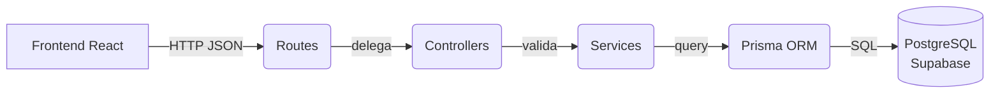

<div align="center">

# SafeAnchor — Backend

**API REST em Express 5 para o MVP de apresentacao do SafeAnchor**


</div>

---

## Sobre

API responsavel pela persistencia, autenticacao e regras de negocio do SafeAnchor.
Recebe requisicoes REST do frontend (React), aplica validacoes, autenticacao JWT
e persiste os dados em PostgreSQL via Prisma ORM.

> Este README documenta **o que**, **como** e **por que**. As decisoes tecnicas ficam
> registradas para a fase oral — nao so "funciona", mas "funciona e eu sei explicar".

## Sumario

- [Arquitetura](#arquitetura)
- [Stack](#stack)
- [Estrutura de pastas](#estrutura-de-pastas)
- [Como rodar](#como-rodar)
- [Endpoints](#endpoints)
- [Regras de negocio](#regras-de-negocio)
- [Decisoes tecnicas](#decisoes-tecnicas)
- [Testes](#testes)
- [Roadmap](#roadmap)

---

## Arquitetura

O backend utiliza **arquitetura em camadas com separacao de responsabilidades**.



| Camada | Responsabilidade |
|---|---|
| `routes/` | Declaracao de endpoints e metodo HTTP |
| `controllers/` | Validacao de payload e formato da resposta HTTP |
| `services/` | Regras de negocio e orquestracao |
| `models/` | Queries estruturadas ao Prisma |
| `lib/prisma.js` | Inicializacao do client Prisma |
| `middleware/` | Autenticacao JWT e controle por roles |

---

## Stack

- **Node.js 20+**
- **Express 5** — framework HTTP
- **Prisma 7** — ORM com type-safety e migracoes declarativas
- **PostgreSQL** (Supabase) — banco de dados gerenciado
- **bcrypt** — hashing de senhas
- **jsonwebtoken** — autenticacao JWT
- **pino + pino-http** — logging estruturado

---

## Estrutura de pastas

```text
apps/backend/
├── prisma/
│   └── schema.prisma                  # schema do banco: modelos + enums
├── src/
│   ├── controllers/
│   │   ├── authController.js          # cadastro e login
│   │   ├── vesselController.js        # embarcacoes
│   │   ├── maintenanceController.js   # manutencoes
│   │   ├── preventiveMaintenanceController.js
│   │   ├── checklistTemplateController.js
│   │   ├── checklistExecutionController.js
│   │   └── healthController.js        # health check
│   ├── lib/
│   │   ├── prisma.js                  # cliente Prisma (singleton)
│   │   └── logger.js                  # pino logger
│   ├── middleware/
│   │   ├── authMiddleware.js          # requireAuth (JWT)
│   │   └── authorizeRoles.js         # controle por persona
│   ├── models/
│   │   ├── vesselModel.js
│   │   ├── maintenanceModel.js
│   │   ├── preventiveMaintenanceModel.js
│   │   ├── checklistTemplateModel.js
│   │   └── checklistExecutionModel.js
│   ├── routes/
│   │   ├── authRoutes.js
│   │   ├── vesselRoutes.js
│   │   ├── maintenanceRoutes.js
│   │   ├── preventiveMaintenanceRoutes.js
│   │   ├── checklistTemplateRoutes.js
│   │   └── checklistExecutionRoutes.js
│   ├── services/
│   │   ├── authService.js             # hashing, JWT, validacoes
│   │   ├── accessScopeService.js      # controle de acesso por ownership
│   │   ├── vesselService.js
│   │   ├── maintenanceService.js
│   │   ├── maintenanceDashboardService.js
│   │   ├── preventiveMaintenanceService.js
│   │   ├── checklistTemplateService.js
│   │   ├── checklistExecutionService.js
│   │   └── modulesService.js
│   ├── app.js                         # criacao do Express, middlewares, rotas
│   └── server.js                      # bootstrap e start do servidor
├── test/
│   ├── authMiddleware.test.js
│   ├── authorization.integration.test.js
│   ├── database.smoke.test.js
│   ├── observability.test.js
│   └── ownership-scope.integration.test.js
├── .env.example
├── package.json
└── README.md
```

---

## Como rodar

```bash
cd apps/backend
npm install
cp .env.example .env     # preencha DATABASE_URL e DIRECT_URL do Supabase
npx prisma generate
npm run dev
```

API sobe em:

```text
http://localhost:3001
```

<details>
<summary><strong>Testando rapidamente com curl</strong></summary>

```bash
# healthcheck
curl http://localhost:3001/health

# cadastro
curl -X POST http://localhost:3001/auth/register \
  -H "Content-Type: application/json" \
  -d '{"name":"Maria","email":"maria@test.com","password":"123456"}'

# login
curl -X POST http://localhost:3001/auth/login \
  -H "Content-Type: application/json" \
  -d '{"email":"maria@test.com","password":"123456"}'

# listar embarcacoes (com token JWT)
curl http://localhost:3001/vessels \
  -H "Authorization: Bearer <token>"
```

</details>

---

## Endpoints

### Publicos (sem autenticacao)

| Metodo | Rota | Descricao |
|---|---|---|
| `GET` | `/` | Status da API |
| `GET` | `/health` | Health check (verifica conexao com o banco) |
| `POST` | `/auth/register` | Cadastro de novo usuario |
| `POST` | `/auth/login` | Login — retorna JWT |

### Autenticados (requer `Authorization: Bearer <token>`)

| Metodo | Rota | Descricao |
|---|---|---|
| `GET` | `/modules` | Modulos disponiveis |
| `GET` | `/vessels` | Lista embarcacoes do usuario |
| `POST` | `/vessels` | Cria embarcacao |
| `PUT` | `/vessels/:id` | Atualiza embarcacao |
| `DELETE` | `/vessels/:id` | Remove embarcacao |
| `GET` | `/maintenances` | Lista manutencoes |
| `POST` | `/maintenances` | Cria manutencao |
| `GET` | `/maintenances/dashboard` | Dashboard de manutencao |
| `GET` | `/preventive-maintenances` | Lista agenda preventiva |
| `POST` | `/preventive-maintenances` | Cria item preventivo |
| `GET` | `/checklist-templates` | Lista templates de checklist |
| `POST` | `/checklist-templates` | Cria template |
| `GET` | `/checklist-executions` | Lista execucoes de checklist |
| `POST` | `/checklist-executions` | Registra execucao |

---

## Regras de negocio

### Autenticacao

- Senhas sao armazenadas com **bcrypt** (custo 10).
- O login retorna um **JWT** com `userId` e `role` (payload minimo).
- Todos os endpoints abaixo de `/auth` requerem token valido no header.

### Ownership (controle de acesso)

O `accessScopeService` garante que um usuario so acesse seus proprios dados:
embarcacoes, manutencoes e execucoes de checklist pertencem ao usuario que as criou.

### Roles

A enum `UserRole` define as personas: `VESSEL_OWNER`, `SERVICE_PROVIDER`, `MARINA`.
O middleware `authorizeRoles` restringe endpoints quando necessario.

### Validacoes

- Emails devem ser unicos (constraint do banco).
- Campos obrigatorios sao validados antes de chegar ao Prisma.
- O `createdAt` e controlado pelo servidor, nunca pelo cliente.

### Seed de desenvolvimento

O seed (`prisma/seed.js`) cria dados de demonstracao com IDs deterministicos
usando `upsert`. Execucao bloqueada sem autorizacao explicita:

```bash
ALLOW_DATABASE_SEED=true npx prisma db seed
```

Cria um usuario demo (`demo@safeanchor.test`, senha `demo123456`) com membership
na organizacao demo e vincula a embarcacao de demonstracao ao `Party` da organizacao.

---

## Decisoes tecnicas

- **Por que camadas separadas?**
  O controller nao deveria saber *como* uma regra de negocio e aplicada,
  e o service nao deveria saber que existe HTTP. Isso permite trocar o
  transporte (HTTP → CLI → job) sem alterar regras.

- **Por que Prisma e nao SQL direto?**
  Type-safety, migracoes declarativas e o ecosystem do Prisma sao ideais
  para um MVP rapido. Prisma Generate cria clientes tipados a partir do schema.

- **Por que Supabase e nao PostgreSQL local?**
  Supabase oferece PostgreSQL gerenciado com backup automatico, conexoes via pooling
  e painel de admin — ideal para MVP sem infraestrutura propria.

- **JWT sem refresh token (MVP)**
  Para o MVP de apresentacao, o token com expiracao simples e suficiente.
  Um sistema de refresh sera necessario na fase de producao.

- **RLS habilitado sem policies**
  Todas as tabelas tem RLS ativo mas sem policies publicas. O acesso acontece
  exclusivamente pelo backend Express usando a conexao Prisma. Policies de
  propriedade serao adicionadas quando autenticacao avancada for necessaria.

---

## Testes

```bash
npm test
```

Testes unitarios e de integracao usando o runner nativo do Node (`node --test`):

- `authMiddleware.test.js` — validacao do middleware de autenticacao
- `authorization.integration.test.js` — controle de acesso por roles
- `observability.test.js` — logging e observabilidade
- `ownership-scope.integration.test.js` — escopo de acesso por ownership

### Smoke test contra o banco

```bash
ALLOW_DATABASE_SMOKE=true npm run test:db:smoke
```

Cria dados com marcador unico `codex-smoke-<timestamp>`, registra todos os IDs
e remove somente esses IDs no bloco `finally`.

---

## Migrations e baseline

A migration inicial representa o schema completo. Para bancos existentes:

```bash
npx prisma migrate diff \
  --from-config-datasource \
  --to-schema=prisma/schema.prisma \
  --script
```

Somente com diff vazio, marque como aplicada:

```bash
npx prisma migrate resolve --applied 0_init
```

Nunca use `prisma migrate reset` ou `prisma db push` no projeto remoto.

---

## Roadmap

- [x] Autenticacao com JWT + bcrypt
- [x] CRUD de embarcacoes
- [x] Manutencao (criar, listar, dashboard)
- [x] Manutencao preventiva
- [x] Templates de checklist
- [x] Execucoes de checklist
- [x] Controle de acesso por ownership
- [x] Roles (VESSEL_OWNER, SERVICE_PROVIDER, MARINA)
- [x] Health check com conexao ao banco
- [x] Seed de desenvolvimento
- [x] Testes de integracao (ownership, authorization)
- [ ] Endpoints de inspecoes (agendamento + certificados)
- [ ] Notificacoes
- [ ] Refresh token
- [ ] Documentacao OpenAPI/Swagger
- [ ] Testes automatizados dos controllers

---

<div align="center">

Desenvolvido por **Luis Botelho** · [GitHub](https://github.com/luis-botelho) · [LinkedIn](https://linkedin.com/in/luis-botelho)

</div>
