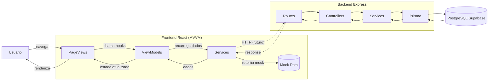

<div align="center">

# SafeAnchor — Frontend

**Interface em React 19 + Vite 7 para o MVP de apresentacao do SafeAnchor**


</div>

---

## Sobre

Interface do SafeAnchor: gestao de frotas, manutencao, inspecoes, checklists,
marinas e dashboard por persona. Arquitetura MVVM com ViewModels isolando a logica
de negocio da camada de apresentacao.

> Este README documenta **o que**, **como** e **por que**. As decisoes tecnicas ficam
> registradas para a fase oral — nao so "funciona", mas "funciona e eu sei explicar".

## Sumario

- [Arquitetura](#arquitetura)
- [Stack](#stack)
- [Estrutura de pastas](#estrutura-de-pastas)
- [Como rodar](#como-rodar)
- [Fluxo de dados](#fluxo-de-dados)
- [Modulos implementados](#modulos-implementados)
- [Decisoes tecnicas](#decisoes-tecnicas)
- [Deploy](#deploy)
- [Roadmap](#roadmap)

---

## Arquitetura

O frontend segue o padrao **MVVM (Model-View-ViewModel)**:

```mermaid
flowchart LR
    A[PageViews<br/>(views/)] -->|chama| B[use*ViewModel hooks<br/>(viewmodels/)]
    B -->|recarrega| C[Services<br/>(services/)]
    C -->|dados mock| D[(Mock Data)]
    C -->|HTTP futuro| E[(Backend API)]
```

| Camada | Responsabilidade |
|---|---|
| `views/` | Paginas (PageViews) — composicao de componentes |
| `viewmodels/` | Hooks `use*` que encapsulam logica de negocio |
| `services/` | Camada de dados — mock atual, HTTP futuro |
| `components/` | Componentes compartilhados (AppShell, Formularios, Cards) |
| `context/` | React Context (autenticacao) |
| `router/` | AppRouter + AppShell (navegacao por persona) |

---

## Stack

- **React 19** — UI library
- **Vite 7** — dev server e build
- **react-router-dom v7** — roteamento SPA com basename dinamico
- **CSS puro com BEM** — co-localizado por componente
- `fetch` nativo para comunicacao com a API (sem lib de requisicao)

---

## Estrutura de pastas

```text
apps/frontend/
├── public/
├── src/
│   ├── components/
│   │   ├── AppShell.jsx               # shell de navegacao por persona
│   │   ├── ProtectedRoute.jsx         # guard de autenticacao
│   │   ├── VesselForm.jsx             # formulario de embarcacoes
│   │   ├── MaintenanceForm.jsx        # formulario de manutencao
│   │   ├── ChecklistTemplateForm.jsx  # formulario de template
│   │   ├── ChecklistExecutionForm.jsx # formulario de execucao
│   │   ├── InspectionCard.jsx         # card de inspecao
│   │   ├── StatusBadge.jsx            # badge de status
│   │   ├── ReadinessGauge.jsx         # gauge de prontidao
│   │   ├── PageHeader.jsx             # cabecalho de pagina
│   │   ├── EmptyState.jsx             # estado vazio
│   │   ├── Icon.jsx                   # icones SVG
│   │   └── ...                        # outros componentes
│   ├── context/
│   │   └── AuthContext.jsx            # contexto de autenticacao
│   ├── mock/
│   │   ├── vessels.js                 # embarcacoes simuladas
│   │   ├── maintenances.js            # manutencoes simuladas
│   │   ├── inspections.js             # inspecoes simuladas
│   │   └── ...
│   ├── router/
│   │   ├── AppRouter.jsx              # rotas da aplicacao
│   │   └── AppShell.jsx               # shell com sidebar por persona
│   ├── services/
│   │   ├── api.js                     # configuracao base (VITE_API_URL)
│   │   ├── vesselService.js           # dados de embarcacoes
│   │   ├── maintenanceService.js      # dados de manutencao
│   │   ├── inspectionService.js       # dados de inspecoes
│   │   ├── checklistTemplateService.js
│   │   ├── checklistExecutionService.js
│   │   ├── maintenanceDashboardService.js
│   │   ├── moduleService.js           # modulos disponiveis
│   │   └── ...
│   ├── viewmodels/
│   │   ├── useVesselsViewModel.js
│   │   ├── useCreateVesselViewModel.js
│   │   ├── useEditVesselViewModel.js
│   │   ├── useMaintenancesViewModel.js
│   │   ├── useMaintenanceDashboardViewModel.js
│   │   ├── useInspectionViewModel.js
│   │   ├── useChecklistTemplatesViewModel.js
│   │   ├── useChecklistExecutionViewModel.js
│   │   └── ...
│   ├── views/
│   │   ├── LoginPage.jsx
│   │   ├── RegisterPage.jsx
│   │   ├── DashboardPage.jsx
│   │   ├── FleetPage.jsx
│   │   ├── VesselDetailPage.jsx
│   │   ├── MaintenancePage.jsx
│   │   ├── InspectionsPage.jsx
│   │   ├── ChecklistTemplatesPage.jsx
│   │   ├── MarinasPage.jsx
│   │   └── ...                       # 40+ paginas
│   ├── styles/
│   │   └── *.css                      # BEM global
│   ├── App.jsx
│   └── main.jsx                       # BrowserRouter com basename
├── vite.config.js                     # base via VITE_BASE_URL
└── package.json
```

---

## Como rodar

```bash
cd apps/frontend
npm install
npm run dev
```

Aplicacao em `http://localhost:5173`. **O backend precisa estar rodando** em
`http://localhost:3000` para autenticacao e dados reais.

```bash
npm run build    # build de producao
npm run lint     # eslint
```

---

## Fluxo de dados



`use*ViewModel` concentra o estado (dados, loading, erro) e expoe funcoes
(`create`, `update`, `delete`). As PageViews apenas orquestram: decidem o que
renderizar e passam os dados adiante.

---

## Modulos implementados

### Conectados ao backend real

| Modulo | Service | ViewModel | Status |
|---|---|---|---|
| Autenticacao | `api.js` | `AuthContext` | Funcional |
| Embarcacoes | `vesselService.js` | `useVesselsViewModel` | Funcional |
| Manutencao | `maintenanceService.js` | `useMaintenancesViewModel` | Funcional |
| Dashboard manutencao | `maintenanceDashboardService.js` | `useMaintenanceDashboardViewModel` | Funcional |
| Manutencao preventiva | `preventiveMaintenanceService.js` | `usePreventiveMaintenanceViewModel` | Funcional |
| Checklist templates | `checklistTemplateService.js` | `useChecklistTemplatesViewModel` | Funcional |
| Checklist execucoes | `checklistExecutionService.js` | `useChecklistExecutionViewModel` | Funcional |

### Com dados mock (demonstracao)

| Modulo | Service | Status |
|---|---|---|
| Inspecoes | `inspectionService.js` | Mock |
| Marinas | `marinaService.js` | Mock |
| Marketplace | `marketplaceService.js` | Mock |
| Comunidade | `communityService.js` | Mock |
| Eventos | `eventService.js` | Mock |
| Academy (treinamento) | `academyService.js` | Mock |
| Jobs & Crew | `jobsService.js` | Mock |
| Trip Planner | `tripService.js` | Mock |
| Documentos | `documentService.js` | Mock |
| IA | `aiService.js` | Mock |

---

## Decisoes tecnicas

- **MVVM em vez de tudo no componente.**
  As PageViews ficam limpas — so compoem e delegam. A logica de negocio vive
  nos ViewModels (`use*ViewModel`) e e reutilizavel entre paginas.

- **Mock data separado por service.**
  Cada modulo tem seu arquivo de dados simulados. Quando o backend estiver pronto,
  o service muda de `return mockData` para `fetch(API_URL)` — nada nos ViewModels
  muda.

- **CSS co-localizado por componente.**
  Cada componente mantém seu arquivo `.css` na mesma pasta. Facilita localizar,
  alterar e remover estilos sem procurar em um CSS monolitico.

- **AppShell com navegacao por persona.**
  O `AppShell` renderiza itens de navegacao diferentes conforme o `role` do usuario
  logado — cada persona enxerga apenas o que e relevante.

- **VITE_BASE_URL para SPA no GitHub Pages.**
  O `base` do Vite e lido de `import.meta.env.VITE_BASE_URL`, setado no CI.
  O `BrowserRouter` usa `basename` dinamico para rotas corretas em subpath.

- **404.html como fallback.**
  O deploy no GitHub Pages copia `index.html` para `404.html` para que rotas
  do react-router funcionem direto na URL.

---

## Deploy

O frontend e deployado automaticamente via **GitHub Actions** no branch `main`:

1. `npm run build` (Vite)
2. Copia `dist/index.html` → `dist/404.html` (SPA fallback)
3. Deploy via `actions/upload-pages-artifact` + `actions/deploy-pages`

**URL:** https://luis-botelho.github.io/safeanchor-monorepo/

---

## Roadmap

- [x] Arquitetura MVVM com ViewModels
- [x] Navegacao por persona (AppShell)
- [x] Autenticacao (login + cadastro + JWT)
- [x] Modulo de embarcacoes (CRUD + prontidao)
- [x] Modulo de manutencao (agenda + dashboard)
- [x] Modulo de checklists (templates + execucoes)
- [x] Modulo de inspecoes (mock)
- [x] Deploy no GitHub Pages
- [x] CI com lint + build
- [ ] Conectar inspecoes ao backend
- [ ] Conectar marinas ao backend
- [ ] Conectar marketplace ao backend
- [ ] Testes automatizados de componentes
- [ ] PWA para uso offline em campo
- [ ] Notificacoes em tempo real

---

<div align="center">

Desenvolvido por **Luis Botelho** · [GitHub](https://github.com/luis-botelho) · [LinkedIn](https://linkedin.com/in/luis-botelho)

</div>
