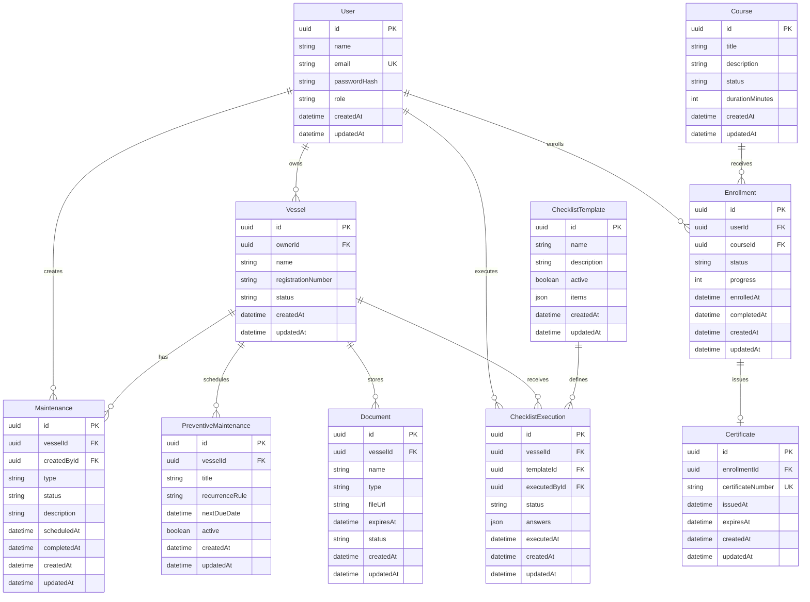

# SafeAnchor Database Architecture

## Purpose

This document defines the target database architecture for SafeAnchor using PostgreSQL and Prisma ORM.

## Core Entities

- User
- Vessel
- Maintenance
- PreventiveMaintenance
- Document
- ChecklistTemplate
- ChecklistExecution
- Course
- Enrollment
- Certificate

## Entity Relationship Overview

SafeAnchor is centered around users and vessels. Vessels own operational records such as maintenance, documents, and checklist executions. Academy records are centered around users, courses, enrollments, and certificates.

## ERD

## Entity Specifications

### User

Represents a platform user.

Primary key:

- `id`

Unique constraints:

- `email`

Relationships:

- owns many vessels;
- creates many maintenance records;
- executes many checklists;
- has many enrollments.

Required fields:

- name;
- email;
- password hash;
- role.

### Vessel

Represents a vessel managed in SafeAnchor.

Primary key:

- `id`

Foreign keys:

- `ownerId` references `User.id`

Relationships:

- has many maintenance records;
- has many preventive maintenance schedules;
- has many documents;
- has many checklist executions.

Constraints:

- `status` must be an allowed vessel status.
- `registrationNumber` should be unique per ownership scope when provided.

### Maintenance

Represents corrective or general maintenance activity.

Primary key:

- `id`

Foreign keys:

- `vesselId` references `Vessel.id`
- `createdById` references `User.id`

Constraints:

- `type` must be an allowed maintenance type.
- `status` must be an allowed maintenance status.
- `completedAt` is required when status is completed.

### PreventiveMaintenance

Represents recurring maintenance planning.

Primary key:

- `id`

Foreign keys:

- `vesselId` references `Vessel.id`

Constraints:

- `nextDueDate` is required.
- `recurrenceRule` must follow a supported recurrence format.
- inactive records should not generate upcoming maintenance alerts.

### Document

Represents a vessel-related file and its metadata.

Primary key:

- `id`

Foreign keys:

- `vesselId` references `Vessel.id`

Constraints:

- `name` is required.
- `type` is required.
- `fileUrl` is required after upload.
- `status` may be derived from expiration and review state.

### ChecklistTemplate

Represents a reusable safety checklist definition.

Primary key:

- `id`

Constraints:

- `name` is required.
- `items` must contain at least one item before active use.
- inactive templates cannot be used for new executions.

### ChecklistExecution

Represents a completed or in-progress checklist execution.

Primary key:

- `id`

Foreign keys:

- `vesselId` references `Vessel.id`
- `templateId` references `ChecklistTemplate.id`
- `executedById` references `User.id`

Constraints:

- completed executions must include answers for required items.
- completed executions should be immutable for audit integrity.

### Course

Represents a Maritime Academy course.

Primary key:

- `id`

Constraints:

- `title` is required.
- `status` must be draft, published, archived, or another supported value.
- published courses must have enough metadata to appear in the catalog.

### Enrollment

Represents a user's participation in a course.

Primary key:

- `id`

Foreign keys:

- `userId` references `User.id`
- `courseId` references `Course.id`

Constraints:

- `progress` must be between 0 and 100.
- one active enrollment per user/course should be allowed.
- `completedAt` is required when status is completed.

### Certificate

Represents proof of course completion.

Primary key:

- `id`

Foreign keys:

- `enrollmentId` references `Enrollment.id`

Unique constraints:

- `certificateNumber`
- `enrollmentId` should be unique if one certificate is allowed per enrollment.

Constraints:

- certificate can only be created for completed enrollment.
- `issuedAt` is required.

## Primary Key Strategy

Use UUID primary keys for all core entities.

Benefits:

- safer public references;
- easier distributed generation;
- future compatibility with multi-region or offline workflows.

## Foreign Key Strategy

Foreign keys should enforce relational integrity for core domain records.

Recommended delete behavior:

- restrict deletion for audit-sensitive records;
- prefer soft delete or archival for vessels, documents, maintenance, and checklist executions;
- cascade only for records that have no independent audit value.

## Indexing Strategy

Recommended indexes:

- `User.email`
- `Vessel.ownerId`
- `Vessel.status`
- `Maintenance.vesselId`
- `Maintenance.status`
- `Maintenance.scheduledAt`
- `PreventiveMaintenance.vesselId`
- `PreventiveMaintenance.nextDueDate`
- `Document.vesselId`
- `Document.expiresAt`
- `ChecklistExecution.vesselId`
- `ChecklistExecution.executedAt`
- `Enrollment.userId`
- `Enrollment.courseId`
- `Certificate.certificateNumber`

## Future Scalability Considerations

### Multi-Tenancy

The MVP can begin with direct user ownership, but the database should be prepared for organization-based ownership.

Future entity:

- Organization
- OrganizationMember
- RolePermission

### Auditability

Safety and compliance records should preserve:

- creator;
- updater;
- timestamps;
- execution user;
- status changes;
- file metadata.

Future enhancement:

- `AuditLog` table.

### File Storage

Document files should not be stored directly in PostgreSQL. Store metadata in the database and files in object storage.

Future fields:

- storage provider;
- file checksum;
- file size;
- content type.

### Reporting

Dashboards may require aggregate queries. Initial dashboards can query transactional tables, but future scale may require:

- materialized views;
- reporting tables;
- event-driven projections.

### Checklist Answers

The MVP may store checklist items and answers as JSON for speed. If reporting becomes more complex, normalize into:

- ChecklistItem;
- ChecklistAnswer.

