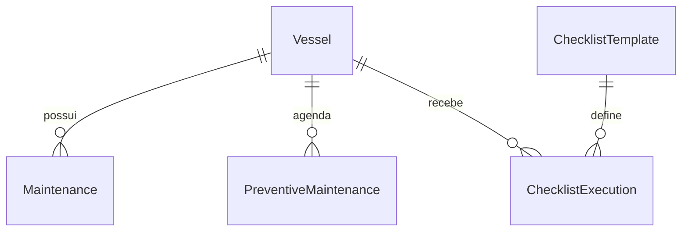

# Arquitetura de banco de dados

O backend usa PostgreSQL hospedado no Supabase e Prisma 7 com
`@prisma/adapter-pg`. O schema atual cobre somente os dominios ja existentes;
autenticacao, documentos e Maritime Academy nao fazem parte desta fundacao.

## Modelos atuais

- `Vessel`
- `Maintenance`
- `PreventiveMaintenance`
- `ChecklistTemplate`
- `ChecklistExecution`

Todos os IDs sao `String` com valor `cuid()` gerado pelo Prisma. Os campos de
data permanecem `String` para preservar os contratos atuais da API. `items` e
`responses` usam JSONB no PostgreSQL.

## Relacionamentos


```mermaid
erDiagram
  Vessel ||--o{ Maintenance : possui
  Vessel ||--o{ PreventiveMaintenance : agenda
  Vessel ||--o{ ChecklistExecution : recebe
  ChecklistTemplate ||--o{ ChecklistExecution : define
```

As quatro chaves estrangeiras possuem indice e usam `ON DELETE CASCADE` e
`ON UPDATE CASCADE`.

## Conexoes

- `DATABASE_URL` e usada somente pelo runtime da API.
- `DIRECT_URL` e usada pelo Prisma CLI para migrations, status e comparacoes.

Os valores reais ficam apenas em `apps/backend/.env`. O arquivo
`apps/backend/.env.example` contem placeholders seguros.

## Baseline

`apps/backend/prisma/migrations/0_init/migration.sql` reproduz o schema completo
a partir de um banco vazio. Para um banco Supabase que ja tenha as tabelas,
compare o schema antes de registrar a baseline:

```bash
cd apps/backend
npx prisma migrate diff \
  --from-config-datasource \
  --to-schema=prisma/schema.prisma \
  --script
```

Se e somente se o resultado estiver vazio:

```bash
npx prisma migrate resolve --applied 0_init
```

Esse comando registra o historico; ele nao deve ser usado para esconder drift.
