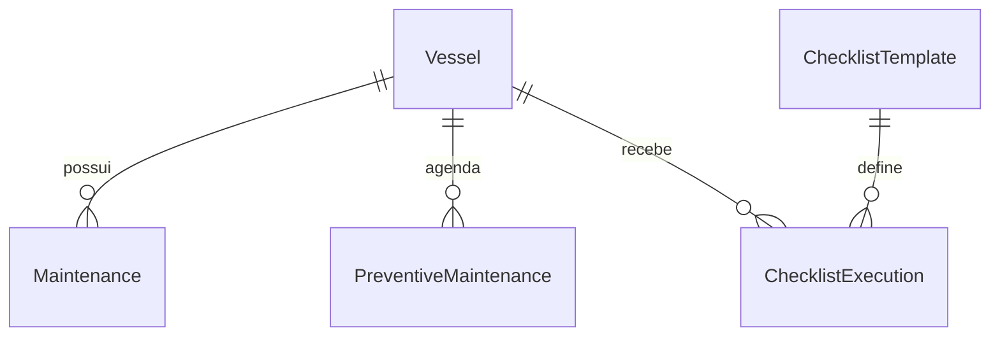
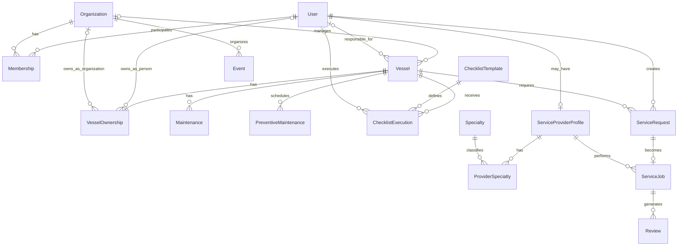

# SafeAnchor — Modelo de Domínio (Conceitual)

> **Escopo deste documento:** modelagem conceitual de dados. Nenhum código, schema Prisma, migration ou dado no Supabase foi alterado para produzir este material.
>
> **Natureza do documento:** este é o **Modelo Entidade-Relacionamento conceitual** do SafeAnchor. Ele representa a visão de domínio do produto — não é, e não precisa ser, um espelho 1:1 do banco físico atual. Algumas entidades aqui descritas ainda **não existem** no PostgreSQL e estão marcadas explicitamente como tal.

---

## 1. Contexto do produto

SafeAnchor é um Vertical SaaS / ecossistema de gestão marítima. O núcleo atual do produto cobre:

- gestão de embarcações por proprietários e por organizações (marinas, operadores de frota);
- manutenção corretiva e preventiva;
- checklists e inspeções;
- gerenciamento futuro de documentos e de recursos marítimos;
- perfis profissionais de prestadores de serviço e contratação por proprietários;
- marketplace de serviços, venda e aluguel (visão futura);
- avaliações entre contratante e prestador;
- gestão de funcionários, profissionais e comunidade dentro de organizações;
- eventos promovidos por organizações;
- expansão futura para IoT, sensores, telemetria e manutenção preditiva.

O foco atual do desenvolvimento é o **núcleo operacional** (embarcações, manutenção, checklists). Marketplace, IoT e módulos avançados de comunidade fazem parte da visão de produto de médio/longo prazo e estão isolados na seção [Expansões futuras](#expansões-futuras).

---

## 2. Modelo atualmente implementado

Este é o **estado físico atual** do banco PostgreSQL (via Prisma), sem nenhuma alteração:



Entidades físicas hoje: `Vessel`, `Maintenance`, `PreventiveMaintenance`, `ChecklistTemplate`, `ChecklistExecution`.

Todo o restante deste documento descreve o **modelo conceitual proposto**, que amplia esse núcleo com conceitos de identidade (`User`, `Organization`), propriedade (`VesselOwnership`), prestação de serviços e comunidade — ainda **não implementados fisicamente**.

---

## 3. Modelo conceitual proposto



### 3.1 Sobre a representação de `VesselOwnership` (leia com atenção)

Esta é a parte mais ambígua do modelo e merece uma explicação explícita em vez de ser escondida atrás do diagrama.

**O problema:** toda `Vessel` tem exatamente um proprietário principal, mas esse proprietário pode ser uma **pessoa** (`User`) ou uma **organização** (`Organization`). ER clássico não tem um jeito nativo de dizer "essa entidade se relaciona com A OU com B, nunca as duas, nunca nenhuma".

**Duas famílias de solução conceitual existem para isso**, e é importante que fique registrado que a escolha entre elas é uma decisão de modelo lógico, não conceitual:

1. **Arco exclusivo (exclusive arc)** — a que usei no diagrama acima. `VesselOwnership` tem uma relação opcional (`0..1`) com `User` e uma relação opcional (`0..1`) com `Organization`, com a regra de negócio (não expressável no ER puro) de que **exatamente um dos dois** deve estar preenchido, nunca os dois, nunca nenhum. É a forma mais direta de desenhar no Mermaid e mais fácil de ler para quem está começando em modelagem.
2. **Supertipo/Party abstrato (generalização)** — criar uma entidade abstrata (`Party` ou `Owner`), da qual `User` e `Organization` seriam subtipos (relação ISA/"é um"). `VesselOwnership` se relacionaria apenas com `Party`. Essa é uma alternativa de generalização/especialização conceitualmente elegante, principalmente se `User` e `Organization` participarem de vários relacionamentos equivalentes, mas aumenta a complexidade do modelo. Como o Mermaid `erDiagram` não tem notação nativa de generalização, ela fica melhor documentada em prosa do que desenhada.

**Decisão para este documento:** usei o arco exclusivo no diagrama por ser mais legível no Mermaid, mas deixo registrada a opção 2 (`Party`/`Owner` abstrato) como alternativa a avaliar no modelo lógico. Ela pode simplificar relacionamentos equivalentes e autorização futura, mas também introduz uma generalização e junções adicionais. Essa escolha está formalmente listada como pendência em [Questões para o modelo lógico](#questões-para-o-modelo-lógico) e **não deve ser assumida como decidida**.

O que este documento **não** faz é decidir a estratégia física (duas FKs nullable com `CHECK`, tabela `Party` genérica, ou até um discriminador `ownerType` + `ownerId` polimórfico sem FK real — que eu desaconselho desde já por quebrar integridade referencial). Isso fica para quando formos ao Prisma.

O relacionamento 1:1 representa somente o **proprietário principal atual**. Se
o SafeAnchor precisar preservar o histórico de transferências de propriedade,
`VesselOwnership` poderá evoluir para uma relação 1:N com `Vessel`, incluindo
atributos temporais que indiquem o período de validade de cada ownership.

### 3.2 Sobre `Management` vs `Ownership`

São conceitos deliberadamente separados:

- **Ownership** (`VesselOwnership`): quem é o dono. No modelo atual, sempre existe, é obrigatório e mantém relação 1:1 com `Vessel`.
- **Management** (`Organization → Vessel : manages`): quem administra operacionalmente. É opcional (`0..1` organização por embarcação) e **não implica propriedade**.

Exemplo do enunciado, para não perder o contexto: Luis é proprietário da `Sea One` (`VesselOwnership` apontando para o `User` Luis); a Marina Azul administra a `Sea One` (`Vessel.manages` apontando para a `Organization` Marina Azul). Uma marina nunca vira dona automaticamente por administrar a embarcação.

### 3.3 Sobre o responsável (marinheiro)

`Vessel → User : responsible_for` é `0..1` do lado da embarcação (uma embarcação pode não ter responsável, e no modelo inicial tem no máximo um) e `0..N` do lado do usuário (um usuário pode responder por várias embarcações). É um modelo propositalmente simplificado — a extensão natural é uma tripulação completa (`Crew`), citada em [Decisões de modelagem](#decisões-de-modelagem) e nas questões em aberto.

### 3.4 Sobre a autoria de `ServiceRequest`

Uma `ServiceRequest` está associada a uma `Vessel`, que identifica onde o
serviço é necessário, mas um `User` é o ator que cria a solicitação no sistema.
Uma `Organization` poderá funcionar futuramente como contexto ou contratante
da solicitação, mas essa parte da modelagem ainda está pendente.

---

## 4. Tabela de entidades

| Entidade | O que representa | Status |
|---|---|---|
| `Vessel` | Uma embarcação cadastrada no sistema | IMPLEMENTADO |
| `Maintenance` | Registro de manutenção associado a uma embarcação | IMPLEMENTADO |
| `PreventiveMaintenance` | Manutenção preventiva planejada/agendada | IMPLEMENTADO |
| `ChecklistTemplate` | Modelo reutilizável de checklist/inspeção | IMPLEMENTADO |
| `ChecklistExecution` | Execução concreta de um checklist em uma embarcação | IMPLEMENTADO |
| `User` | Pessoa cadastrada no SafeAnchor, sem tipo fixo | PLANEJADO MVP |
| `Organization` | Marina, operador de frota, estaleiro, escola náutica, empresa de serviços etc. | PLANEJADO MVP |
| `Membership` | Associação N:N entre `User` e `Organization`, com papel/cargo | PLANEJADO MVP |
| `VesselOwnership` | Registro de propriedade de uma `Vessel` (pessoa ou organização) | PLANEJADO MVP |
| `ServiceProviderProfile` | Perfil profissional de um `User` que presta serviços | VISÃO FUTURA / pós núcleo |
| `Specialty` | Especialidade técnica (elétrica naval, motores, pintura etc.) | VISÃO FUTURA |
| `ProviderSpecialty` | Associação N:N entre `ServiceProviderProfile` e `Specialty` | VISÃO FUTURA |
| `ServiceRequest` | Solicitação de serviço aberta para uma `Vessel` | VISÃO FUTURA |
| `ServiceJob` | Execução/contratação efetiva de um serviço | VISÃO FUTURA |
| `Review` | Avaliação vinculada a um `ServiceJob` | VISÃO FUTURA |
| `Event` | Evento/atividade publicado por uma `Organization` | VISÃO FUTURA |

---

## 5. Tabela de relacionamentos

| Entidade A | Cardinalidade | Entidade B | Significado |
|---|---|---|---|
| `User` | N:N via `Membership` | `Organization` | um usuário pode participar de várias organizações, e uma organização tem vários usuários associados |
| `Vessel` | 1:1 | `VesselOwnership` | toda embarcação tem exatamente um registro de propriedade |
| `VesselOwnership` | 0..1 : 0..N | `User` | um proprietário-pessoa pode ser dono de várias embarcações; a ownership pode não apontar para um `User` (se for de organização) |
| `VesselOwnership` | 0..1 : 0..N | `Organization` | uma organização pode ser dona de várias embarcações; a ownership pode não apontar para uma `Organization` (se for de pessoa) |
| `Organization` | 0..1 : 0..N | `Vessel` | uma organização pode administrar várias embarcações; uma embarcação tem no máximo uma organização administradora |
| `User` | 0..1 : 0..N | `Vessel` | um usuário pode ser o responsável por várias embarcações; uma embarcação tem no máximo um responsável no modelo inicial |
| `Vessel` | 1:N | `Maintenance` | uma embarcação possui vários registros de manutenção |
| `Vessel` | 1:N | `PreventiveMaintenance` | uma embarcação tem várias manutenções preventivas agendadas |
| `Vessel` | 1:N | `ChecklistExecution` | uma embarcação recebe várias execuções de checklist |
| `ChecklistTemplate` | 1:N | `ChecklistExecution` | um template define várias execuções |
| `User` | 0..1 : 0..N | `ChecklistExecution` | (futuro) um usuário executa várias inspeções; nem toda execução precisa ter executor registrado hoje |
| `User` | 1 : 0..1 | `ServiceProviderProfile` | um usuário pode opcionalmente ter um perfil de prestador |
| `ServiceProviderProfile` | N:N via `ProviderSpecialty` | `Specialty` | um prestador pode ter várias especialidades, e uma especialidade classifica vários prestadores |
| `User` | 1:N | `ServiceRequest` | um usuário pode criar várias solicitações; cada solicitação possui um usuário autor |
| `Vessel` | 1:N | `ServiceRequest` | uma embarcação pode gerar várias solicitações de serviço |
| `ServiceRequest` | 1 : 0..1 | `ServiceJob` | uma solicitação pode virar, no máximo, um job de execução |
| `ServiceProviderProfile` | 1:N | `ServiceJob` | um prestador executa vários jobs |
| `ServiceJob` | 1:N | `Review` | um job pode gerar avaliações |
| `Organization` | 1:N | `Event` | uma organização publica vários eventos |

---

## 6. Decisões de modelagem

1. `User` **não** possui um campo simples de tipo (`OWNER` / `EMPLOYEE` / `SERVICE_PROVIDER`). A mesma pessoa pode acumular papéis diferentes ao mesmo tempo.
2. Papéis (proprietário, funcionário, prestador, responsável) **surgem dos relacionamentos e perfis** do usuário, não de um enum fixo.
3. `User` e `Organization` se relacionam N:N, resolvido pela entidade associativa `Membership`.
4. Toda `Vessel` possui **exatamente um** proprietário principal, representado por `VesselOwnership`.
5. O proprietário pode ser uma **pessoa OU uma organização** — nunca as duas, nunca nenhuma (regra de arco exclusivo).
6. A **estratégia física** para representar esse "pessoa OU organização" (arco exclusivo com duas FKs nullable vs. `Party` abstrato) **ainda não foi decidida** — fica para o modelo lógico.
7. Organização administradora (`manages`) é um conceito **diferente** de propriedade (`VesselOwnership`). Administrar não implica ser dono.
8. `Vessel` tem, no modelo inicial, **zero ou uma** organização administradora.
9. `Vessel` tem, no modelo inicial, **zero ou um** `User` responsável principal.
10. O conceito de responsável poderá evoluir futuramente para um modelo completo de tripulação (`Crew`), com múltiplos membros e papéis a bordo.
11. Marketplace **não** será implementado nesta fase — apenas documentado como visão futura.
12. IoT **não** será implementado nesta fase — apenas documentado como visão futura.
13. Este modelo conceitual é **intencionalmente maior** que o schema físico atual: ele existe para orientar decisões futuras, não para descrever o banco de hoje.

---

## 7. Expansões futuras

Estes conceitos **não fazem parte** do DER principal (seção 3) e não devem ser tratados como decididos ou implementados.

### 7.1 Marketplace

- `Listing`
- `VesselSale`
- `VesselRental`
- `ServiceOffering`
- `ProductListing`

Ideia geral: expandir `ServiceRequest`/`ServiceJob` para um marketplace público de venda, aluguel de embarcações e oferta de serviços/produtos. Nenhum desses conceitos tem cardinalidade ou atributos definidos ainda.

### 7.2 IoT / telemetria

Direção provável (não definitiva):

```
Vessel → IoTDevice → Sensor → Telemetry
```

Um `IoTDevice` seria vinculado a uma `Vessel`, exporia um ou mais `Sensor`, e cada `Sensor` geraria uma série temporal de `Telemetry`. Isso abriria caminho para manutenção preditiva, mas depende de decisões de infraestrutura (ingestão de série temporal, retenção de dados, etc.) fora do escopo deste documento.

---

## 8. Questões para o modelo lógico

Perguntas que precisamos responder **antes** de tocar no `schema.prisma`:

- Como representar ownership pessoa OU organização na prática: arco exclusivo (duas FKs nullable + `CHECK`) ou entidade `Party`/`Owner` abstrata?
- Vale a pena introduzir um `Party`/`Owner` abstrato desde já, mesmo custando uma junção a mais em queries?
- `Vessel` poderá ter coproprietários no futuro (ownership N:N em vez de 1:1)?
- A organização administradora será sempre `0..1`, ou evoluirá para `N:N` (ex.: mudança de administradora ao longo do tempo, com histórico)?
- Como representar tripulação completa (`Crew`) além do responsável único atual?
- `Membership.role` deve ser um enum simples ou uma entidade própria (permitindo múltiplos papéis por membership, permissões granulares etc.)?
- Uma organização pode acumular vários tipos simultaneamente (ex.: marina que também é empresa de manutenção)? Isso deveria ser modelado como `OrganizationType` N:N em vez de um campo fixo?
- Como conectar `Maintenance`/`PreventiveMaintenance` a `ServiceJob` quando o marketplace existir?
- Como modelar avaliações bidirecionais (contratante avalia prestador e vice-versa) a partir de um único `ServiceJob` — duas linhas em `Review` com uma coluna de direção, ou duas entidades separadas?
- Como implementar multi-tenancy e isolamento de dados entre organizações?
- Como a estratégia de ownership escolhida vai impactar autorização e Row Level Security (RLS) no Supabase?

---

*Documento gerado como material de referência conceitual. Nenhum arquivo além deste (`docs/architecture/domain-model.md`) foi criado ou alterado. Nenhum commit foi realizado.*
